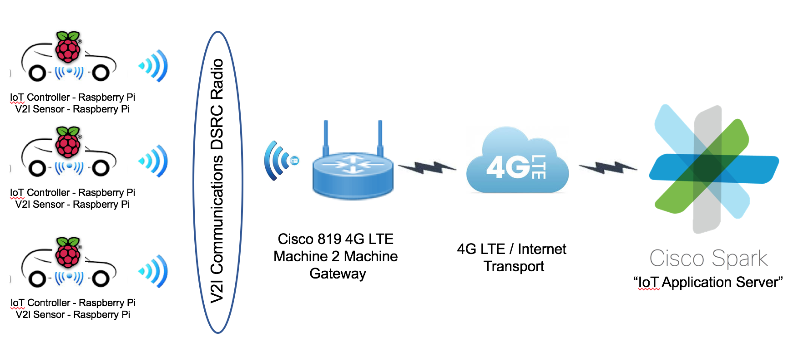

# Autonomous Driving Cars and Sensors 

## Coding with Raspberry Pi and Cisco Spark

This project was conceived as a means to introduce coding, IoT sensors and cloud applications to high school students. No coding experience is required.

It attempts to simulate an **Autonomous Intersection Management Traffic 
Control System** using the Raspberry Pi to simulate a sensor and Cisco Spark service to simulate a cloud based application server.

**Figure 1:** *Setup of simulation environment*

This specific use case was conceived from research done by University of Texas, Austin published in this [video](https://www.youtube.com/watch?v=4pbAI40dK0A).

The Raspberry Pi was build with a [sensor kit][kit_id]
from Sunfounder. The [source code][code_id] was modified and integrated with the [Cisco Spark API's][spark_id] and application logic using Python 2.7.

All scripts were running on the Raspberry Pi.

[kit_id]:(https://www.sunfounder.com/learn/Super_Kit_V2_for_RaspberryPi/lesson-2-controlling-an-led-by-a-button-super-kit-for-raspberrypi.html) 
[code_id]:(https://github.com/sunfounder/Sunfounder_SuperKit_Python_code_for_RaspberryPi/blob/master/02_btnAndLed.py) 
[spark_id]:(https://developer.ciscospark.com/getting-started.html) 
 
--- 

## Repo Information
* *README.md*
	* This document
* *Application Files*
	* /root - initial test modules
	* /final - combined modules
* *docs*
	* Intructions to run through the modules
* *images*
	* Images used in instruction documents	  	   	

## Application Files in /root
Applications here are intended to test all the component functions and call seperately

* *notes.txt*
	* Used to capture variables required for calling the functions below 
* *testSensor.py*
	* Used to test that the circuit is working 
* *roomId.py*
	* Called to determine what spaces I belong to
* *isMember.py*
	* Prints a list of members in the space defined with roomId
* *postMsg.py*
	* Called to post messages (and images) to your Spark space identified by *roomId*

## Application files in /final folder
These functions tests the "sensor", "application server" and application logic as an integrated system

* *testAppLogic.py*
	* This module is intended to test the application logic without a Raspberry Pi. Since the Raspberry Pi acts as a sensor providing an on or off state to the application, that state can be set statically using the Led_status variable.
	* All calls to Cisco Spark will still be called
* *spark.py*
	* Handles the interaction with the Cisco Spark service.
* *sensor.py*
	* This is the main module for this project
* *cleanUp.py*
	* Script to save work to Spark space and clean up files from Raspberry Pi

	
 