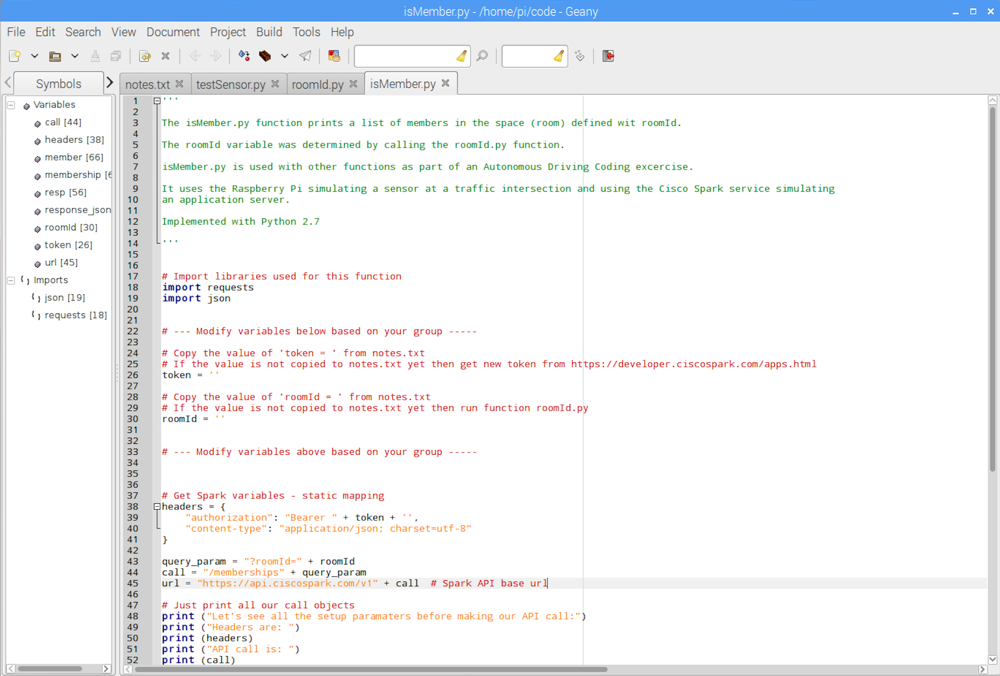

# Instructions

Instruction guide for coding Autonomous Cars with Raspberry Pi and Cisco Spark

## Contents 

- [Overview](#overview)
- [Setup your Raspberry Pi workspace](#setup-your-raspberry-pi-workspace)
- [Get your code from GitHub](#get-your-code-from-github)
- [Test your Raspberry Pi Sensor](#test-your-raspberry-pi-sensor)
- [Your team space in Cisco Spark](#your-team-space-in-cisco-spark)
- [Get Spark Authentication token](#get-spark-authentication-token)
- [Retrieve your roomId](#retrieve-your-roomid)
- [Make Spark call to isMember](#make-spark-call-to-ismember)
- [Post a message to your Spark Room](#post-a-message-to-your-spark-room)
- [Put it all together](#put-it-all-together)
- [Save your work to your Space](#save-your-work-to-your-space)
- [Clean up](#cleanup)

## Overview
The objective of the project is to simulate the implementation of an Autonomous Intersection Management Traffic Control System for driverless cars.

A Vehicle to Infrastructure (V2I) sensor is simulated with Raspberry Pi and the Cisco Spark service is used to simulate a cloud based application server.

The Raspberry Pi is also acting as an IoT (Internet of Things) controller which performs control functions (does the vehicle proceed though the intersection or should it wait on another reservation) based on sensor data and application server rules. It uses Python as the programing language.

## Setup your Raspberry Pi workspace
Ensure that you Raspberry Pi has a wireless connection. Look for the wireless status icon on the top right of your screen.

From the Taskbar open the web browser.

From the Taskbar open a terminal session. Resize the screen for an easier view.

Notice your default prompt:

	pi@raspberrypi:~ $

The default directory in your terminal session is your home directory.

	pi@raspberrypi:~ $ pwd
	/home/pi
	pi@raspberrypi:~ $ 
	
At any time to get back to your home directory type:

	pi@raspberrypi:~ $ cd ~
	pi@raspberrypi:~ $ 

From the Taskbar open the Geany Code Editor: 

*`Raspberry Icon... Programs... Geany...`*

## Get your code from GitHub
The code for our project is posted to GitHub. The software is stored in collections called repositories. Each repository represent a project. A GitHub repository enables software developers share code and collaborate with other developers.  

We will clone the GitHub repository to a directory on your Raspberry Pi.

Type the following URL into your browser:

	https://github.com/ddchristian

Click on the project named `RaspberryPi-Autonomous-Car`

Copy the resulting URL from your browser. 

Type in the following commands into a terminal session:

	mkdir code
	git clone https://github.com/ddchristian/RaspberryPi-Autonomous-Car ./code 

From the Geany Editor click *`File... Open`* and open the following files in the ~/code directory:

* notes.txt
* testSensor.py
* roomId.py
* isMember.py
* postMsg.py

Now we're ready to start running the code !!

## Test your Raspberry Pi Sensor

Your Raspberry Pi has a breadboard attached to it with a circuit that acts as a Vehicle to Infrastructure (V2I) sensor. If your Raspberry Pi circuit is not completed use the diagram below to complete the circuit.

	
Open a terminal window and run the ~/code/testSensor.py script to test your sensor.

	pi@raspberrypi:~ $ cd code 
	pi@raspberrypi:~/code $ python testSensor.py

Once the Python application is running push the sensor button to toggle the LED on and off. To run your application later on the LED should be in the ON state.


## Your team space in Cisco Spark

Sign up for a free Cisco Spark account at `https://web.ciscospark.com`

Decide on a team name and create a space with your team name. *`Message... + sign... Creat a Space...`*

Add all of you team member to the Spark space. *`Show space activities... People... Add Person`*

Do google search to find an image file

Copy the URL for team logo in notes.txt

Download the image to your home directory

Add the image to your team space. *`Click i next to team name... Edit Space... Add image`*

## Get Spark Authentication token
When making API calls against a secure service an authentication token is used instead of the typical username and password. The authentication token is an encrypted form of your username and password and is easier to pass with an API call.

Go to `developer.ciscospark.com` and login.

You will notice your profile picture in the top right of the screen once you have logged in.
Hover over your avatar and that will display you token. 


Copy your token and save it the notes.txt in file in your ~/code directory

It should look something like:
	
`token = 'NjkyOTcwMjAtMTgxZi00MzRhLTk2NTUtNmMwMjk0NDQ1MDYyN2Q'`



## Retrieve your roomId

Make Spark call to get roomId

Since there you could have multiple spaces and since there are multiple users registered to the Cisco Spark service the service needs a way to identify and reference your intended object (space, user or message, etc) correctly it assigns it an object id that is guarenteed to be unique across the entire Cisco Spark service.

In order to post messages to your space we first need to retrieve your space roomId. 

*Note: A room is the same as a space. With the original version of Cisco Spark the term `Rooms` were used. That has been updated to `Spaces`. Since the original API was developed using rooms it is really hard to change an API hence you'll see rooms referenced in the API calls and documentation.*

Go to your Geany editor edit the file `~/code/roomId.py`

Copy your token (from notes.txt) and paste into the `token = ''` field of roomId.py 

It should look something like:
	
`token = 'NjkyOTcwMjAtMTgxZi00MzRhLTk2NTUtNmMwMjk0NDQ1MDYyN2Q'`

Save the file.

From terminal run the application:

	pi@raspberrypi:~ $ python roomId.py

The roomId.py script prints a list of Spark Spaces that you belong to.

Copy the roomId for the space you want to post to.

Paste it in the notes.txt file to the field `spaceId = ''` field and save the file.



## Make Spark call to isMember
Go to your Geany editor edit the file  `~/code/isMember.py`

Copy your token (from notes.txt) and paste into the `token = ''` field of isMember.py. 

It should look something like:
	
`token = 'NjkyOTcwMjAtMTgxZi00MzRhLTk2NTUtNmMwMjk0NDQ1MDYyN2Q'`

Copy your roomId (from notes.txt) into the `roomId = ''` field.

It should look something like:
	
`roomId = 'NjkyOTcwMjAtMTgxZi00MzRhLTk2NTUtNmMwMjk0NDQ1MDYyN2Q'`

From terminal run the application:

	pi@raspberrypi:~ $ python isMember.py

The isMember.py script prints a list of members in a specific Spark space.
	
Ensure that all your team members are listed in the space.


## Post a message to your Spark Room
Go to your Geany editor edit the file `~/code/postMsg.py`

Copy your token (from notes.txt) and paste into the `token = ''` field of postMsg.py. 

Copy your roomId (from notes.txt) into the `roomId = ''` field.

From terminal run the application:

	pi@raspberrypi:~ $ python postMsg.py

Enter a message you would like to have posted in your space.

Copy your team image URL (from notes.txt) when prompted for and image.


## Put it all together
Edit notes.txt file and add the following:

`ReservationUser (choose someone in your group) =`

`ReservationToken (email of ReservationUser) =`

In Geany Editor navigate to `~/code/final` directory

Open the following files:
`spark.py`
`sensor.py`

Edit `sensor.py` and add all the required variables.

From terminal change directory to your `~/code/final` folder and run `sensor.py`

	pi@raspberrypi:~/code $ pwd
	home/pi/code
	pi@raspberrypi:~ $ cd final
	pi@raspberrypi:~/code/final $
	pi@raspberrypi:~/code/final $ python sensor.py

This represented that a reservation was granted and that the vehicle could proceed through the intersection. 

To simulate what a denied reservation would look like change `reservationToken` to an email that is not associated to anything in your space (a fake email will do). That should create a fail condition when you test against your Space memberships.

Run `sensor.py` again

## Save your work to your Space
You can follow this part if you want to save your code to review later. Run the following commands:

	cd ~/code
	rm –rf .git
	rm –rf .idea
	cd ~
	zip –r autonomous.zip ./code/

Go to `https://web.ciscospark.com/` and log into your Spark account.

Select the file `autonomous.zip` and share it to your space.

## Clean up
Change to your home directory and delete your `code` directory

	pi@raspberrypi:~/code/final $ cd ~
	pi@raspberrypi:~ $ rm autonomous.zip (if created above)
	pi@raspberrypi:~ $ rm -rf code
	pi@raspberrypi:~ $

Go to `developer.ciscospark.com`
Click on your avatar and log out of your account. 
This resets your spark token

Go to your browser... menu on the right top of your browser

Select settings on the top right then 

`Settings` ...Click `Show advanced settings`... `Privacy`... Click `Clear browsing data`

Place a check box for every option displayed

Change `Obliterate the following item from`.... select `the beginning of time`

Click `Clear browsing data` at bottom.

	
